# 🌍⚡ DisasterWatch

A cloud-ready, real-time disaster monitoring platform that aggregates global disaster signals using **NASA EONET + USGS**, normalizes multi-source API responses into a single schema, visualizes events on an interactive map, and uses **Kafka** for event-driven processing via producer/consumer microservices.

Note: The project is designed to be **fully runnable on localhost** via Docker Compose (cloud deployment is optional). This makes it easy to demo in interviews without requiring cloud credentials.

---

## ✅ Features

### 1) Multi-Source Disaster Data (NASA EONET + USGS)
- Fetches global disaster data from:
  - **USGS** (Earthquakes)
  - **NASA EONET** (Wildfires, floods, storms, etc.)
- Normalizes heterogeneous API responses into a single unified model
- Performance-safe rendering (pagination + marker caps)

### 2) Live Dashboard (Map + Feed + KPI)
- Interactive **world map** with disaster markers
- Live disaster feed with pagination
- KPI overview:
  - Total disasters
  - Active alerts (high severity)
  - Countries affected

### 3) Filtering, Search, Sorting
- Filter by disaster type:
  - Earthquakes
  - Wildfires
  - Floods
  - Storms
- Search by country/city keyword
- Sorting options:
  - Newest
  - Severity

### 4) Severity Scoring (LOW / MEDIUM / HIGH)
- Each event is classified into severity levels
- Severity badges shown directly in the feed
- Helps prioritize critical events

### 5) Event-Driven Architecture (Kafka)
DisasterWatch streams disaster events through Kafka to decouple ingestion from processing.

**Producer (Backend)**
- After processing/normalizing disaster data, backend publishes structured messages to Kafka topic:
  - `disaster-events`

Example message:
``json
{
  "type": "earthquake",
  "location": "Turkey",
  "severity": "high",
  "timestamp": "2026-03-08T22:25:00Z"
}`

**Consumer (Notification Service)**
- Subscribes to `disaster-events`
- Logs received events (ready for future alert pipelines: Email/SMS/WebSocket push)

### 6) Dockerized Microservices (Local + Cloud-Ready)
- Fully containerized services:
  - frontend (React build served by Nginx)
  - backend (Node.js + Express)
  - db (PostgreSQL)
  - kafka (Confluent Kafka) + zookeeper
  - notification-service (Kafka consumer)
- Runs locally with a single Docker Compose command

### 7) Bonus UI Modules (Demo-Ready)
- Alerts page UI (demo)
- Admin console UI (demo)
- News modal UI (demo)

---

## 🖼 App Screenshots

### 1) Main Dashboard (KPI + Map + Live Feed)
Shows the complete overview: KPIs at the top, map markers, and live feed on the right.  
📸: `screenshots/01-dashboard.png`  
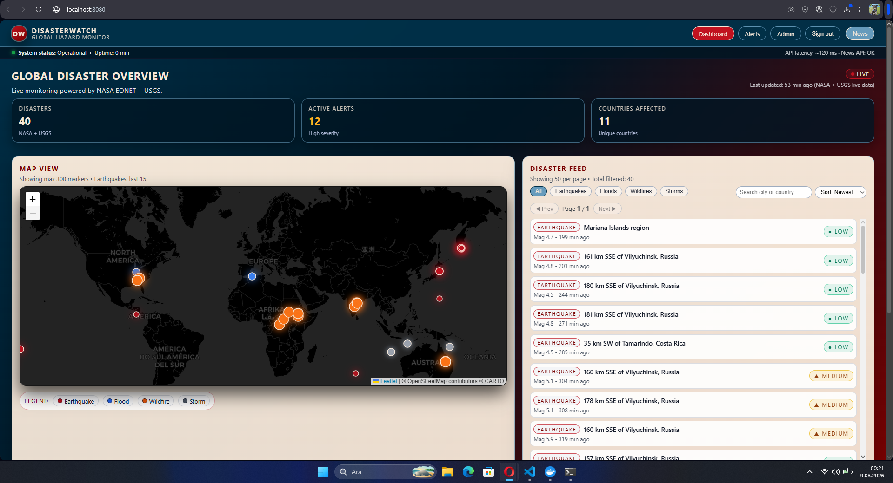

---

### 2) Backend Health (API Proof)
Confirms backend is running and reachable through the reverse proxy `/api`.  
📸: `screenshots/02-api-health.png`  
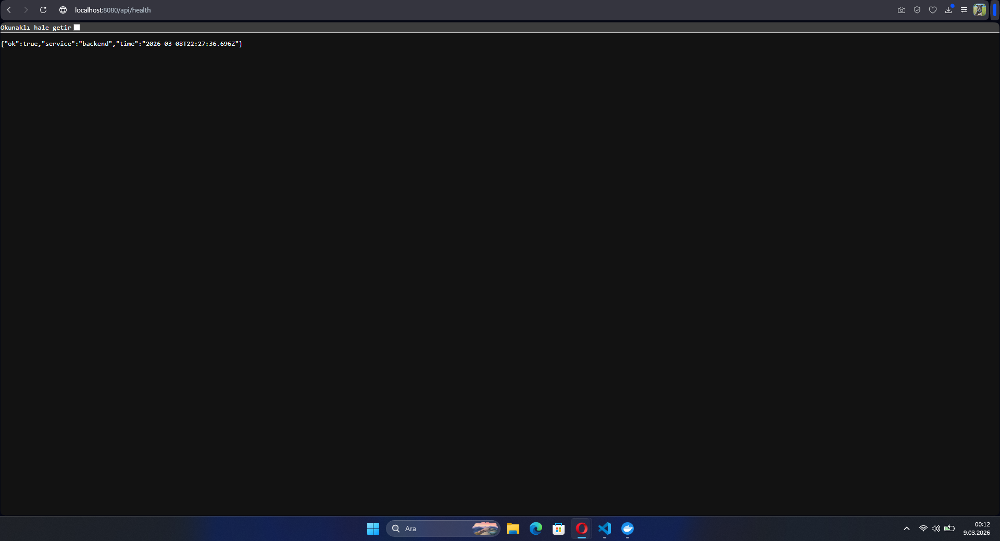

---

### 3) Disasters API Response (Normalized Output)
Shows normalized disasters data returned by the backend.  
📸: `screenshots/03-api-disasters.png`  
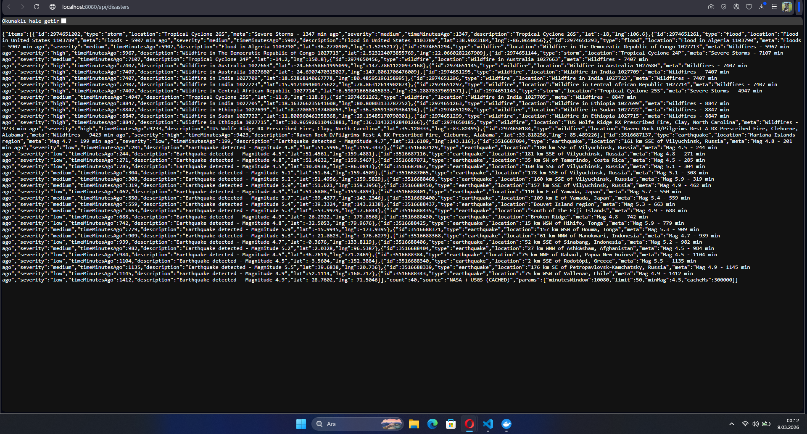

---

### 4) Disasters API Response (Alt View)
Alternative capture (useful to show larger payload / different portion).  
📸: `screenshots/03-api-disasters-alt.png`  
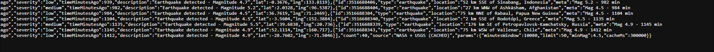

---

### 5) Docker Compose (All Services Up)
Proves that frontend, backend, database, Kafka, zookeeper, and notification service are all running together.  
📸: `screenshots/04-compose-ps.png`  
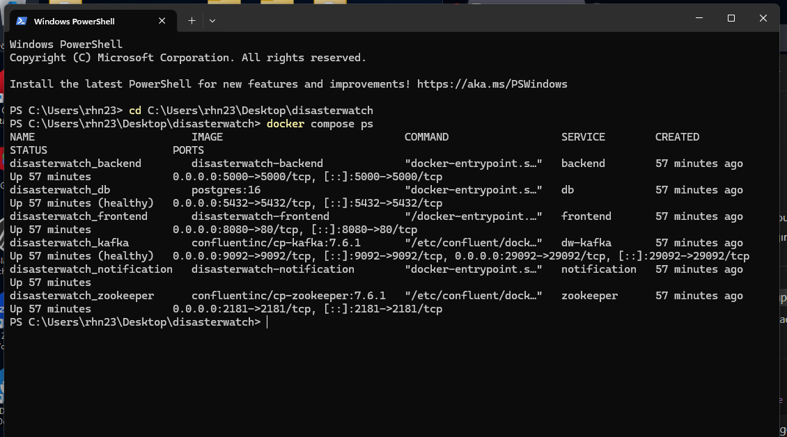

---

### 6) Kafka Consumer Receives Event (End-to-End Proof)
Shows the notification-service consuming a message from Kafka topic.  
📸: `screenshots/05-kafka-event-received.png`  
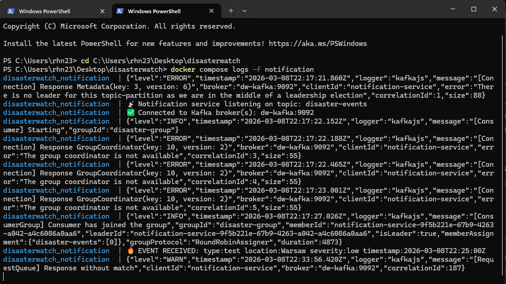

---

### 7) Kafka Topics (Topic Exists)
Confirms the `disaster-events` topic exists.  
📸: `screenshots/06-kafka-topics.png`  
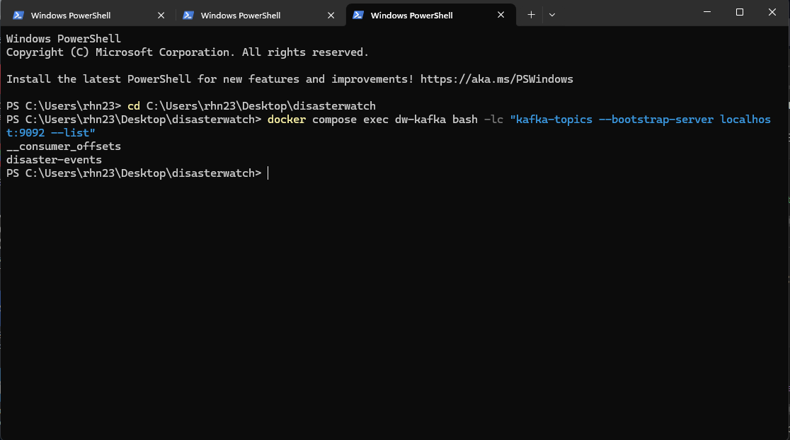

---

### 8) Filter Example — Earthquakes
Clicking Earthquakes updates the feed and map context.  
📸: `screenshots/07-filter-earthquakes.png`  
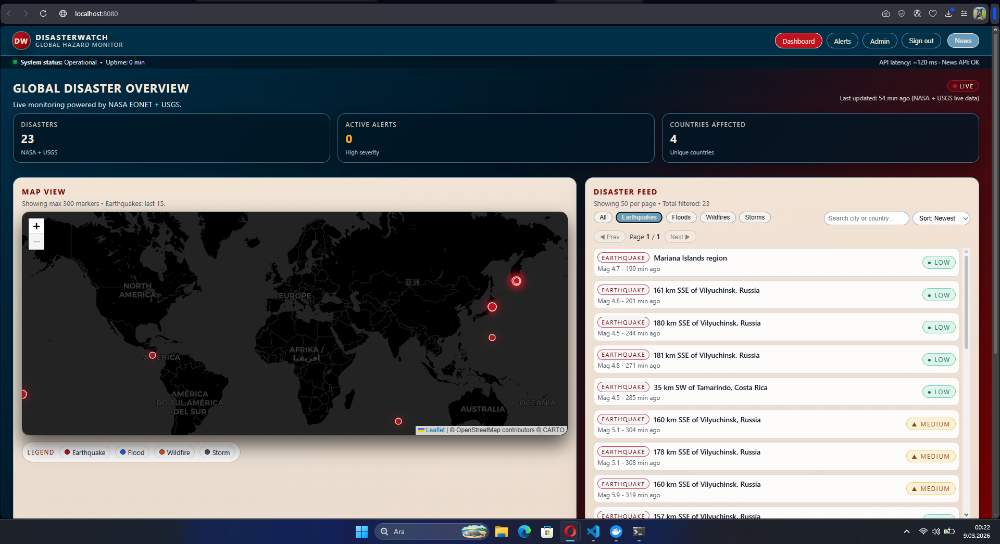

---

### 9) Filter Example — Wildfires
Switching to Wildfires updates markers and feed.  
📸: `screenshots/08-filter-wildfires.png`  
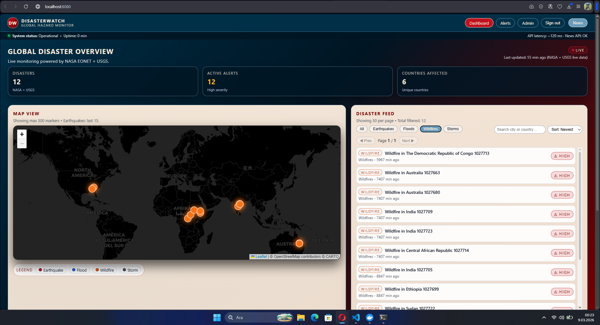

---

### 10) Search Example (Country/City)
Search input filters events by keyword (country/city).  
📸: `screenshots/09-search-country.png`  
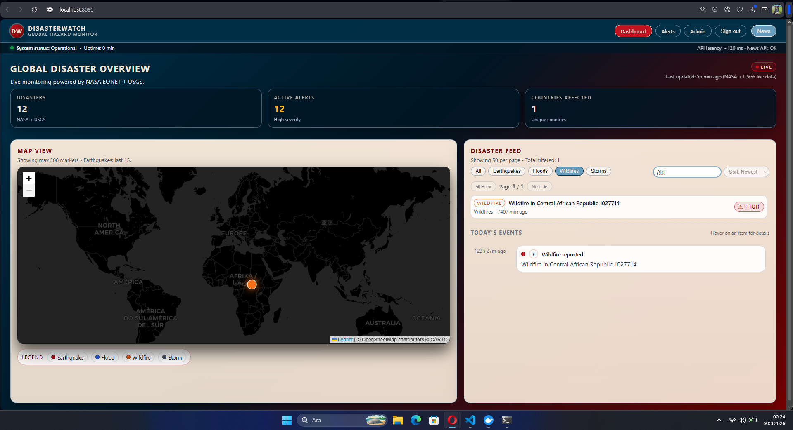

---

### 11) Sort Example — Newest
Sort dropdown configured for Newest (time-based monitoring).  
📸: `screenshots/10-sort-newest.png`  
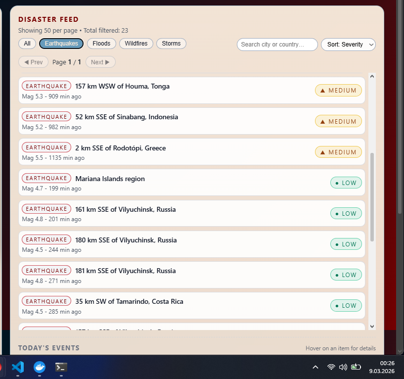

---

### 12) Sort Example — Severity
Sort dropdown configured for Severity (critical-first view).  
📸: `screenshots/10-sort-severity.png`  
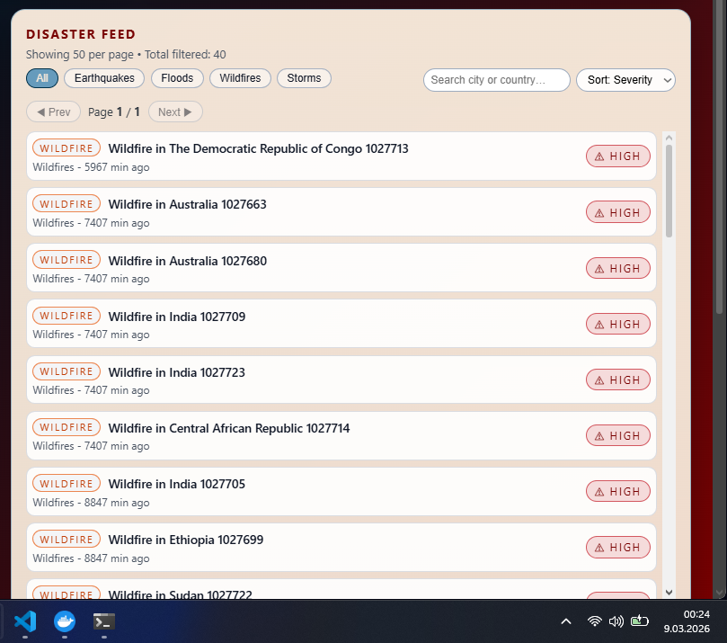

---

### 13) Severity Badges (LOW / MEDIUM / HIGH)
Shows severity classification badges inside the feed.  
📸: `screenshots/11-severity-badges.png`  
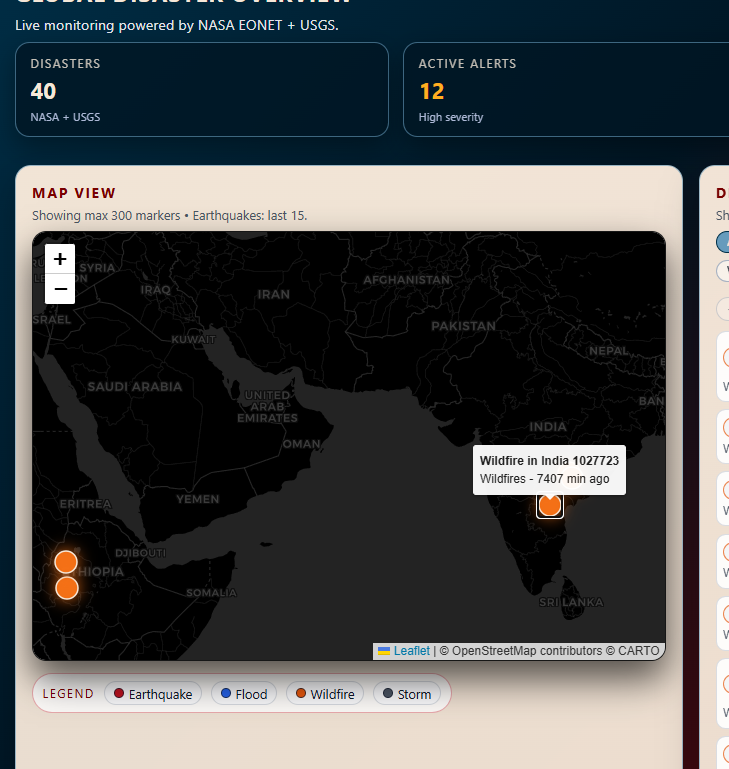

---

### 14) Map Marker Popup / Detail
Clicking a marker reveals detail popup.  
📸: `screenshots/12-map-popup.png`  
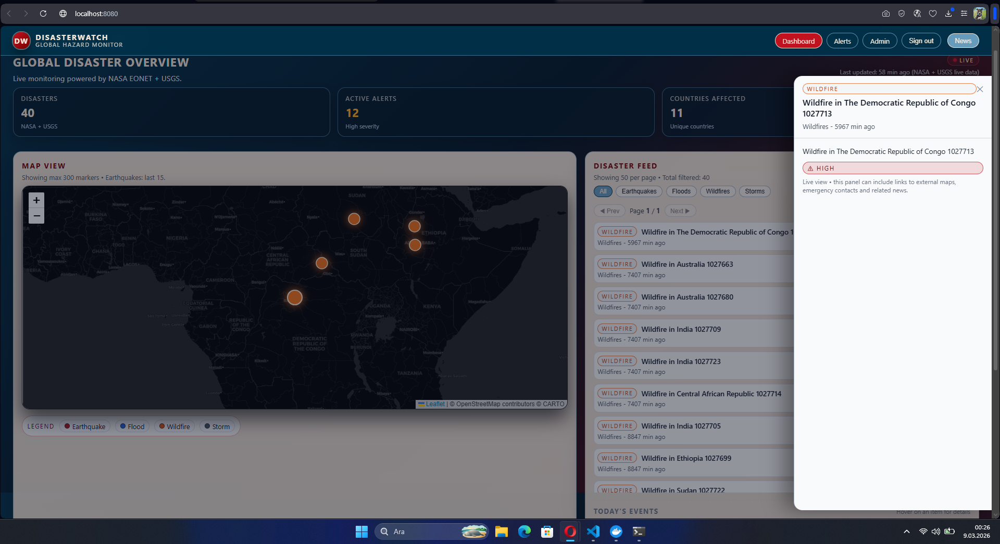

---

### 15) Alerts Page (Demo UI)
Demo UI for alert rules & channels (future persistence ready).  
📸: `screenshots/16-alerts-page.png`  
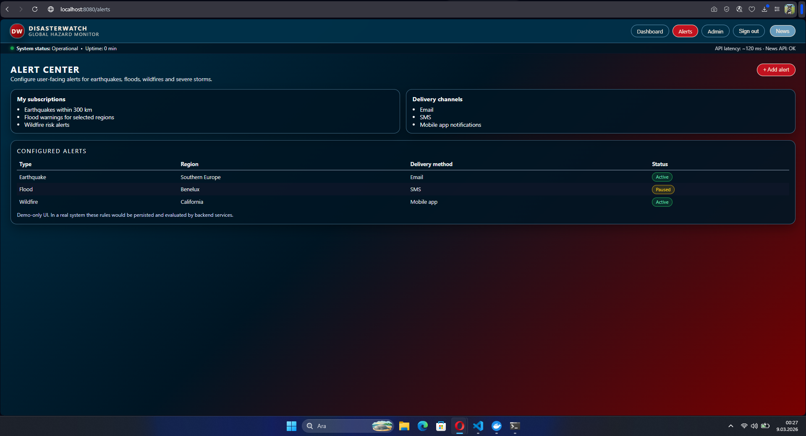

---

### 16) Admin Console (Demo UI)
Demo operator panel for creating demo disaster entries.  
📸: `screenshots/17-admin-console.png`  
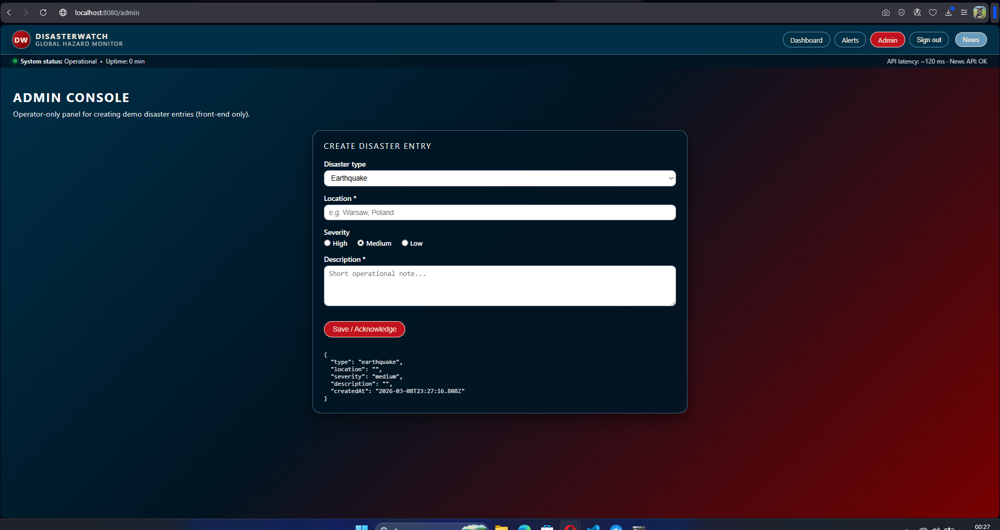

---

### 17) News Modal (Demo UI)
In-app modal showing disaster-related news.  
📸: `screenshots/18-news-modal.png`  
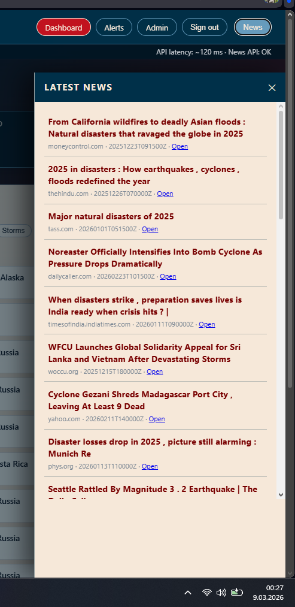

---

## 🧰 Tech Stack
- **Frontend:** React, TypeScript, Vite, Leaflet  
- **Backend:** Node.js, Express, Prisma ORM, Zod, REST API  
- **Streaming:** Kafka (Confluent), KafkaJS Producer/Consumer  
- **Infra:** Docker, Docker Compose, Nginx reverse proxy  
- **Cloud (optional):** Azure Container Apps + ACR

---

## 🐳 Setup (Important)
This project runs locally via Docker Compose.

### 1) Create env file

cp backend/.env.example backend/.env
2) Run with Docker
docker compose up --build
### URLs
- **Frontend:** http://localhost:8080  
- **Backend health:** http://localhost:5000/health  
- **Proxy health:** http://localhost:8080/api/health  
- **Proxy disasters:** http://localhost:8080/api/disasters  

---

## 🧪 Kafka Demo (Send a test event)

### Send a test message to `disaster-events`
echo "{\"type\":\"test\",\"location\":\"Warsaw\",\"severity\":\"low\",\"timestamp\":\"2026-03-08T22:25:00Z\"}" \ | docker compose exec -T dw-kafka bash -lc "kafka-console-producer --bootstrap-server localhost:9092 --topic disaster-events"
docker compose logs -f notification
---

### 🔒 Notes on Security

- .env, .env.local, .env.docker are excluded from version control
- Secrets are not committed
- Only .env.example is included

---

### 🚀 Future Improvements

-WebSocket live broadcasting (real-time UI updates)
-Severity-based notification pipeline (Email/SMS/Push)
-Persist alert rules in DB
-Observability: metrics + tracing (Prometheus/Grafana)
-Multi-region cloud deployment hardening

---

### 👨‍💻 Author

Orhan Izmirli
Computer Science Student (Poland)
Project focus: Full-stack development, event-driven architecture, distributed systems, and cloud-ready deployments.
