# DisasterWatch

A cloud-ready, real-time disaster monitoring platform that aggregates global disaster signals using **NASA EONET + USGS**, normalizes multi-source API responses into a single schema, visualizes events on an interactive map, and uses **Kafka** for event-driven processing via producer/consumer microservices.

Note: The project is designed to be **fully runnable on localhost** via Docker Compose (cloud deployment is optional). This makes it easy to demo in interviews without requiring cloud credentials.

---

## Features

### 1) Multi-Source Disaster Data (NASA EONET + USGS)
- Fetches global disaster data from:
  - **USGS** (Earthquakes)
  - **NASA EONET** (Wildfires, floods, storms, etc.)
- Normalizes heterogeneous API responses into a single unified model
- Performance-safe rendering (pagination + marker caps)

### 2) Live Dashboard (Map + Feed + KPI)
- Interactive **world map** with disaster markers
- Live disaster feed with pagination
- KPI overview:
  - Total disasters
  - Active alerts (high severity)
  - Countries affected

### 3) Filtering, Search, Sorting
- Filter by disaster type:
  - Earthquakes
  - Wildfires
  - Floods
  - Storms
- Search by country/city keyword
- Sorting options:
  - Newest
  - Severity

### 4) Severity Scoring (LOW / MEDIUM / HIGH)
- Each event is classified into severity levels
- Severity badges shown directly in the feed
- Helps prioritize critical events

### 5) Event-Driven Architecture (Kafka)
DisasterWatch streams disaster events through Kafka to decouple ingestion from processing.

**Producer (Backend)**
- After processing/normalizing disaster data, backend publishes structured messages to Kafka topic:
  - `disaster-events`

Example message:
```json
{
  "type": "earthquake",
  "location": "Turkey",
  "severity": "high",
  "timestamp": "2026-03-08T22:25:00Z"
}
```

**Consumer (Notification Service)**
- Subscribes to `disaster-events`
- Logs received events (ready for future alert pipelines: Email/SMS/WebSocket push)

### 6) Dockerized Microservices (Local + Cloud-Ready)
- Fully containerized services:
  - frontend (React build served by Nginx)
  - backend (Node.js + Express)
  - db (PostgreSQL)
  - kafka (Confluent Kafka) + zookeeper
  - notification-service (Kafka consumer)
- Runs locally with a single Docker Compose command

### 7) Bonus UI Modules (Demo-Ready)
- Alerts page UI (demo)
- Admin console UI (demo)
- News modal UI (demo)

---

## App Screenshots

### 1) Main Dashboard (KPI + Map + Live Feed)
Shows the complete overview: KPIs at the top, map markers, and live feed on the right.  
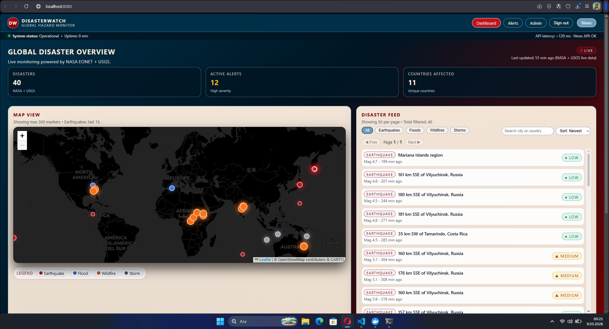

---

### 2) Backend Health (API Proof)
Confirms backend is running and reachable through the reverse proxy `/api`.  
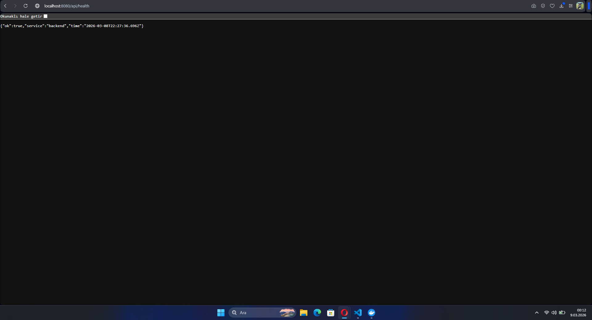

---

### 3) Disasters API Response (Normalized Output)
Shows normalized disasters data returned by the backend.  
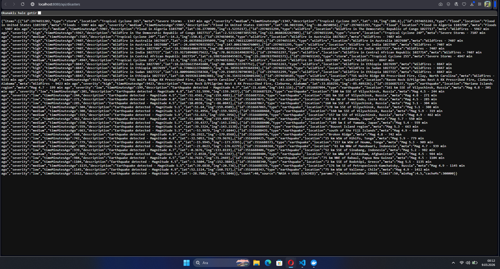

---

### 4) Disasters API Response (Alt View)
Alternative capture (useful to show larger payload / different portion).  
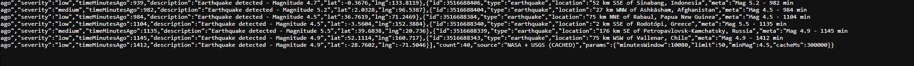

---

### 5) Docker Compose (All Services Up)
Proves that frontend, backend, database, Kafka, zookeeper, and notification service are all running together.  
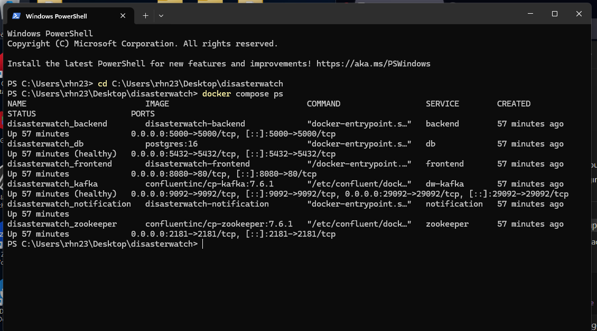

---

### 6) Kafka Consumer Receives Event (End-to-End Proof)
Shows the notification-service consuming a message from Kafka topic.  
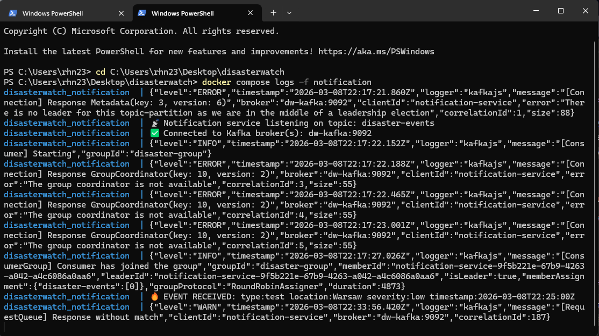

---

### 7) Kafka Topics (Topic Exists)
Confirms the `disaster-events` topic exists.  
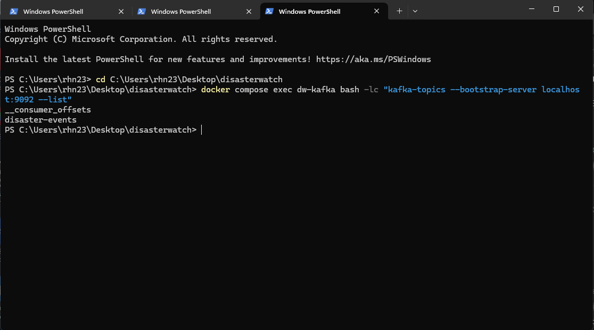

---

### 8) Filter Example — Earthquakes
Clicking Earthquakes updates the feed and map context.  
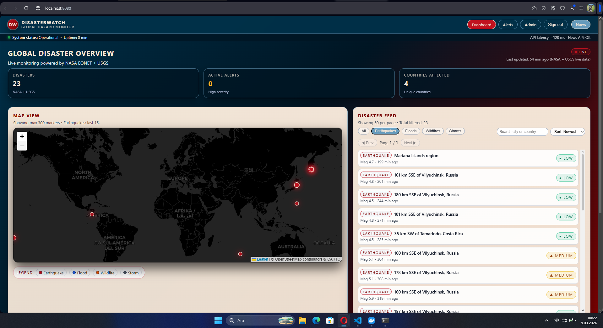

---

### 9) Filter Example — Wildfires
Switching to Wildfires updates markers and feed.  
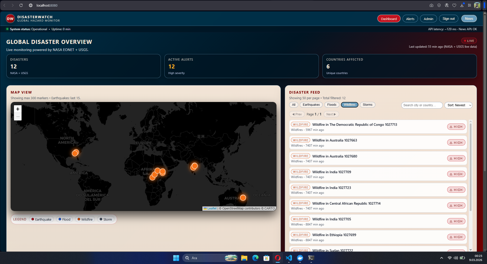

---

### 10) Search Example (Country/City)
Search input filters events by keyword (country/city).  
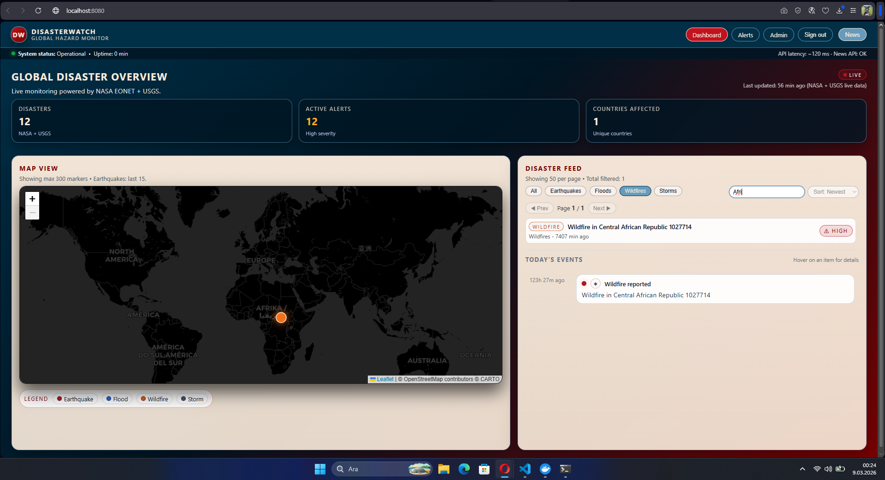

---

### 11) Sort Example — Newest
Sort dropdown configured for Newest (time-based monitoring).  
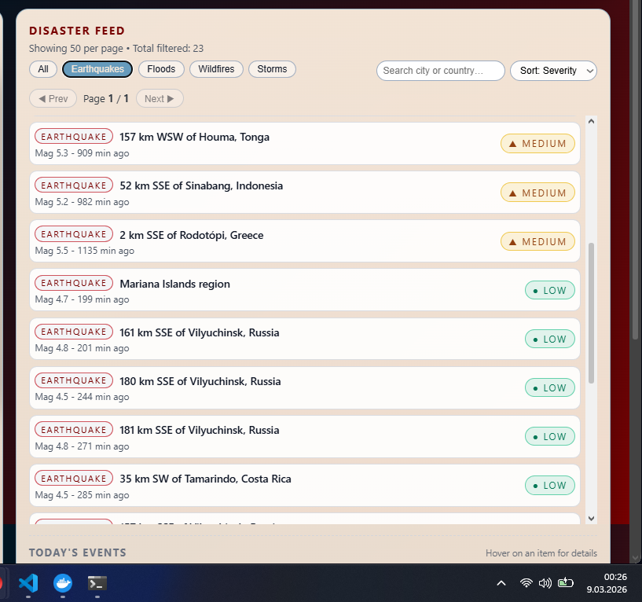

---

### 12) Sort Example — Severity
Sort dropdown configured for Severity (critical-first view).  
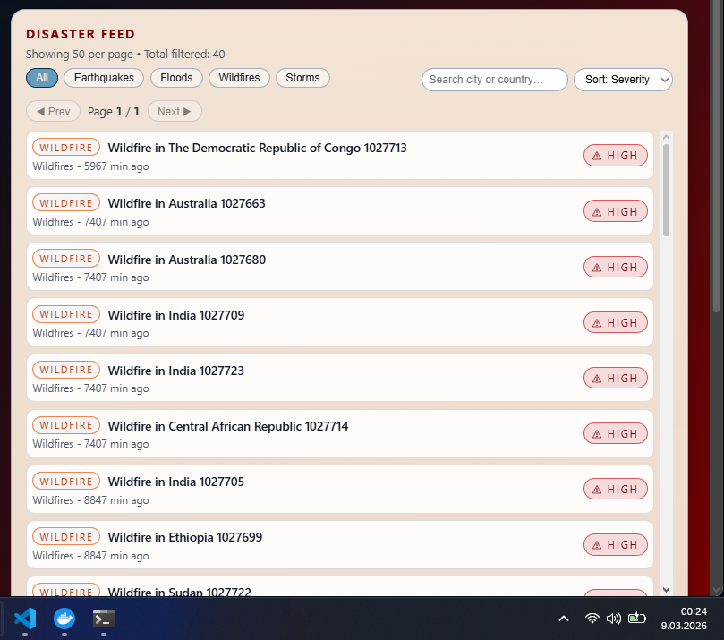

---

### 13) Severity Badges (LOW / MEDIUM / HIGH)
Shows severity classification badges inside the feed.  
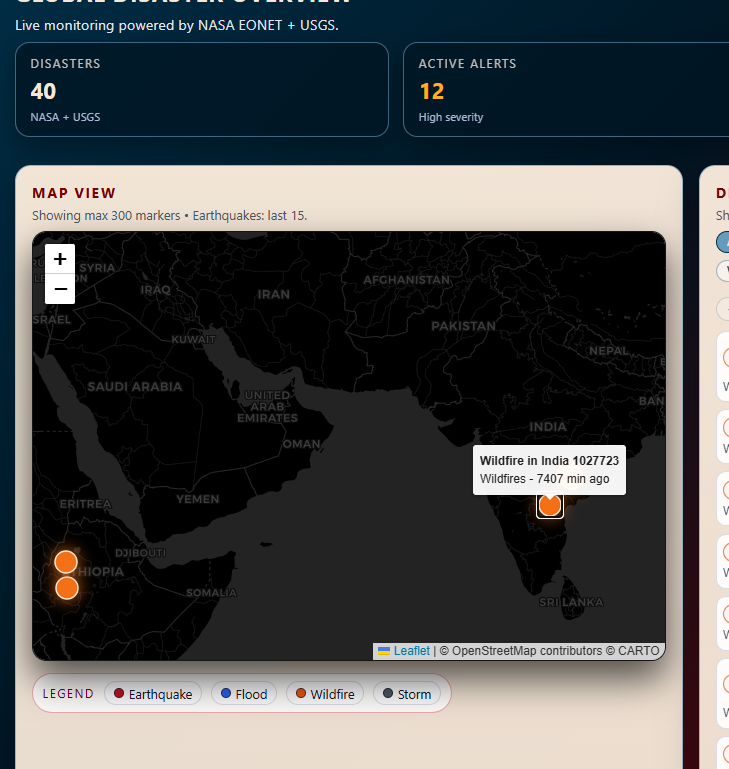

---

### 14) Map Marker Popup / Detail
Clicking a marker reveals detail popup.  
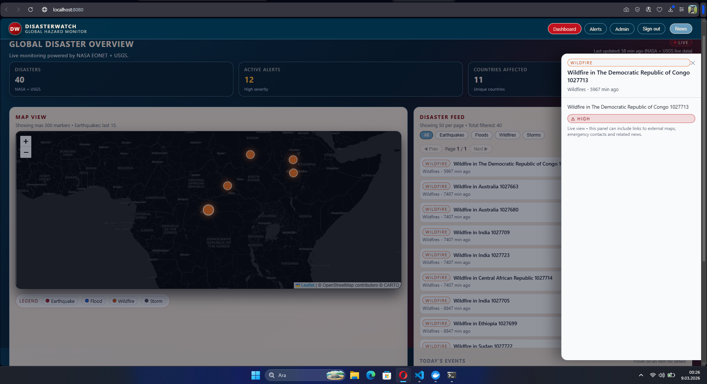

---

### 15) Alerts Page (Demo UI)
Demo UI for alert rules & channels (future persistence ready).  
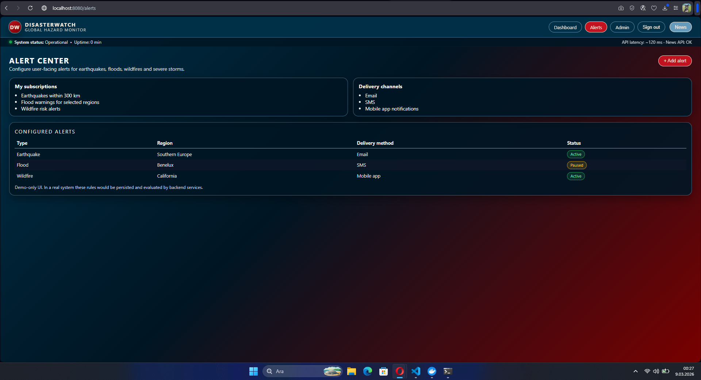

---

### 16) Admin Console (Demo UI)
Demo operator panel for creating demo disaster entries.  
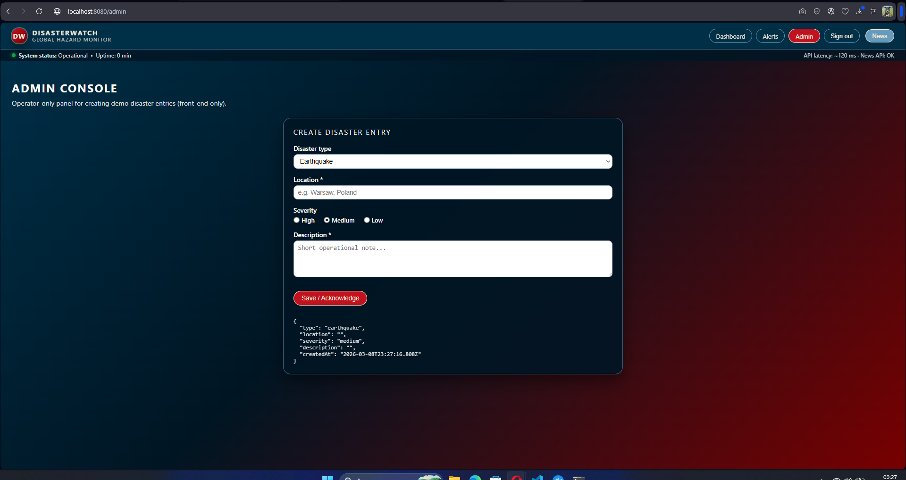

---

### 17) News Modal (Demo UI)
In-app modal showing disaster-related news.  
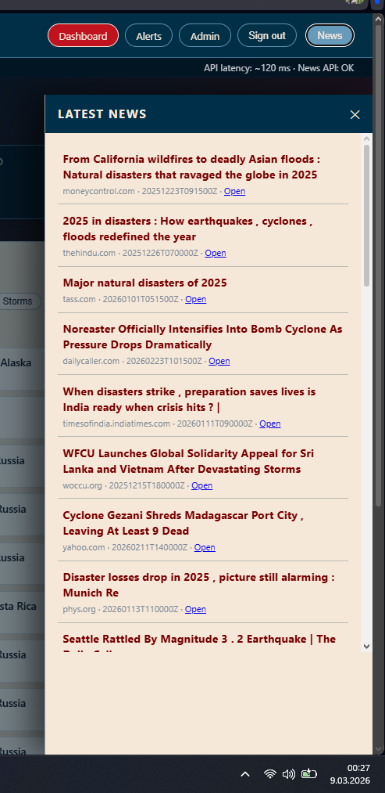

---

## Tech Stack
- **Frontend:** React, TypeScript, Vite, Leaflet  
- **Backend:** Node.js, Express, Prisma ORM, Zod, REST API  
- **Streaming:** Kafka (Confluent), KafkaJS Producer/Consumer  
- **Infra:** Docker, Docker Compose, Nginx reverse proxy  
- **Cloud (optional):** Render (frontend + services), Neon (PostgreSQL), Aiven (Kafka)

---

## Setup (Important)
This project runs locally via Docker Compose.

### 1) Create env file

```bash
cp backend/.env.example backend/.env
```

### 2) Run with Docker

```bash
docker compose up --build
```

### URLs
- **Frontend:** http://localhost:8080  
- **Backend health:** http://localhost:5000/health  
- **Proxy health:** http://localhost:8080/api/health  
- **Proxy disasters:** http://localhost:8080/api/disasters  

---

## Kafka Demo (Send a test event)

### Send a test message to `disaster-events`

```bash
echo "{\"type\":\"test\",\"location\":\"Warsaw\",\"severity\":\"low\",\"timestamp\":\"2026-03-08T22:25:00Z\"}" \
| docker compose exec -T dw-kafka bash -lc "kafka-console-producer --bootstrap-server localhost:9092 --topic disaster-events"
```

Then check the consumer output:

```bash
docker compose logs notification
```

---

## Cloud Deployment (Free Tiers)

The same code runs in the cloud; only environment variables change. Without the Kafka SASL variables everything behaves exactly like the local Docker Compose setup.

| Component | Service |
|---|---|
| Frontend | Render Static Site |
| Backend | Render Web Service (Docker, `backend/`) |
| Notification service | Render Web Service (Docker, `notification-service/`) |
| PostgreSQL | Neon |
| Kafka | Aiven for Apache Kafka (free tier) |

### 1) Kafka (Aiven)
1. Create a free Kafka service.
2. In **Advanced configuration**, enable `kafka_authentication_methods.sasl`.
3. Create the topic `disaster-events` (automatic topic creation is off by default).
4. From the **SASL** connection details, copy the host:port, user, password and the CA certificate.

The free tier powers off after a period without traffic; it can be started again from the Aiven console.

### 2) Database (Neon)
Create a database and copy its connection string (keep `?sslmode=require`). Push the Prisma schema once from your machine:

```bash
cd backend
npm install
DATABASE_URL="postgresql://...neon.tech/...?sslmode=require" npm run db:push
```

### 3) Backend and notification service (Render)
Create two **Web Services** from this repository with the **Docker** runtime, root directories `backend` and `notification-service`, and health check path `/health`.

| Variable | Backend | Notification | Example |
|---|---|---|---|
| `DATABASE_URL` | yes | | Neon connection string |
| `JWT_SECRET` | yes | | a long random string |
| `KAFKA_BROKER` | yes | yes | `kafka-xxxx.aivencloud.com:12345` (comma-separated for several brokers) |
| `KAFKA_SASL_USERNAME` | yes | yes | `avnadmin` |
| `KAFKA_SASL_PASSWORD` | yes | yes | from Aiven |
| `KAFKA_SASL_MECHANISM` | optional | optional | `scram-sha-256` (default), `scram-sha-512` or `plain` |
| `KAFKA_SSL_CA` | yes* | yes* | CA certificate (PEM); newlines may be written as `\n` |

\* Not needed if `letsencrypt_sasl` is enabled on the Aiven service, since a public CA is used then.

Render provides `PORT` automatically; both services read it. Free Render web services sleep after inactivity, so the consumer only processes messages while the service is awake.

### 4) Frontend (Render Static Site)
- Root directory: `disasterwatch-frontend`
- Build command: `npm ci && npm run build`
- Publish directory: `dist`
- Redirects/Rewrites, in this order:
  - `/api/*` → `https://<backend-service>.onrender.com/*` (Rewrite)
  - `/*` → `/index.html` (Rewrite)

The frontend calls relative `/api/...` paths, so the first rule plays the role of the Nginx proxy used locally.

---

### Notes on Security

- .env, .env.local, .env.docker are excluded from version control
- Secrets are not committed
- Only .env.example is included

---

### Future Improvements

- WebSocket live broadcasting (real-time UI updates)
- Severity-based notification pipeline (Email/SMS/Push)
- Persist alert rules in DB
- Observability: metrics + tracing (Prometheus/Grafana)
- Multi-region cloud deployment hardening

---

### Deployment Status / Changelog

**2026-10-07**

- Azure Container Apps + ACR was the initial deployment plan; it was dropped because of cost and operational complexity in favor of a free-tier stack: Render, Neon and Aiven.
- Removed the Azure-specific comments from `backend/Dockerfile`.
- Added `.dockerignore` files for the backend and notification service to keep the build context and images lean (no host `node_modules` or `.env` files).
- Currently going live: a custom domain will be purchased and DNS and SSL will be configured.

---

### Author

Orhan Izmirli
Computer Science Student (Poland)
Project focus: Full-stack development, event-driven architecture, distributed systems, and cloud-ready deployments.
